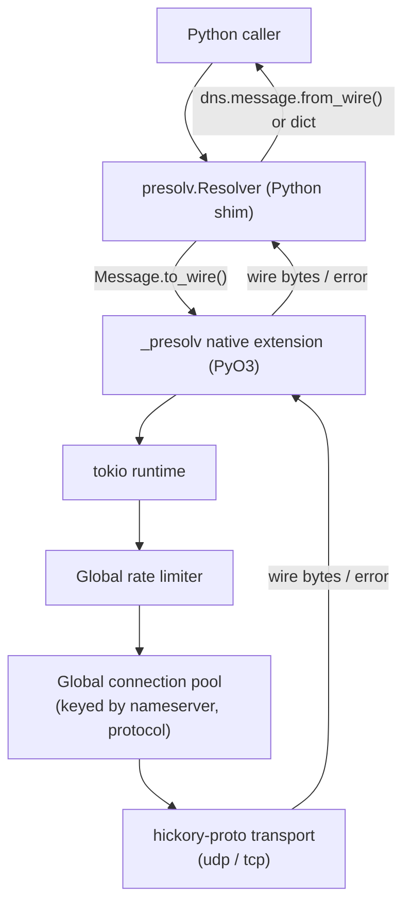

# Presolv Specification

## 1. Overview

Presolv is a high-performance DNS resolver Python module. The core engine is written in Rust and exposed to Python as a native extension (via PyO3). Presolv is designed for bulk and streaming DNS resolution workloads: resolving large lists of queries, draining queues, or feeding results to/from message brokers such as Kafka or RabbitMQ.

Design goals:
Response objects are either `dnspython` `Message` objects (default) or a nested dictionary representation of the response message, selectable per `Resolver` instance.

## 2. Features

- Accepts `dnspython` `Message` objects as input queries.
- Uses the OS system resolver configuration as the default nameserver list.
- Each query can specify its own target nameserver and transport protocol.
- Global control over query rate (queries per second).
- Global connection pooling for efficient, bounded concurrent query management.
- All queries are sent asynchronously internally to maximize throughput, regardless of the (synchronous) Python API surface.
- Returns an iterator of DNS query results, yielded in completion order.
- Broker-agnostic streaming: works with plain lists, generators, or generators wrapping a Kafka/RabbitMQ consumer — presolv has no broker-specific dependencies or code.

## 3. Architecture



**Responsibility boundary (important):** the Rust core is intentionally agnostic of `dnspython`. It only ever handles:

- input: raw wire bytes (`bytes`) + `nameserver` (`str`) + `protocol` (`str`) + per-call overrides (timeout/retries)
- output: raw wire bytes (`bytes`) on success, or a structured error, plus transport metadata (elapsed time, which nameserver/protocol was used, correlation index)

All conversion between `dns.message.Message` objects (or the `dict` response format) and wire bytes happens in the pure-Python shim (`presolv/__init__.py` and `presolv/_convert.py`). This keeps the native extension's PyO3 surface small and reusable, and keeps all `dnspython` version compatibility concerns in Python.

## 4. Repository / module layout

```
presolv/
├── Cargo.toml                   # Rust crate (cdylib), hickory-proto, hickory-resolver (system conf only), tokio, pyo3
├── pyproject.toml               # [tool.maturin] build backend
├── src/
│   ├── lib.rs                   # #[pymodule] entry point; registers Resolver, ResultIter, exceptions
│   ├── resolver.rs              # Resolver struct: owns tokio Runtime, RateLimiter, ConnectionPool, config
│   ├── pool.rs                  # Global connection pool (key: (nameserver, protocol))
│   ├── rate_limiter.rs          # Global token-bucket rate limiter
│   ├── query.rs                 # Internal Query / QueryResult structs
│   ├── transport.rs             # hickory-proto based udp/tcp senders
│   └── error.rs                 # PresolvError enum <-> Python exception mapping
├── python/
│   └── presolv/
│       ├── __init__.py          # Public API: Resolver, Result, resolve_stream
│       ├── errors.py            # PresolvError hierarchy (pure Python wrappers)
│       ├── _convert.py          # wire bytes <-> dns.message.Message / dict conversion
│       └── _presolv.pyi         # Type stubs for the native extension module
├── tests/                       # Rust integration tests (cargo test), mock DNS responder
└── python/tests/                # pytest suite (unit + integration against mock responder)
```

## 5. Python API reference

### 5.1 `Resolver`

```python
class Resolver:
    def __init__(
        self,
        nameservers: list[str] | None = None,
        timeout: float = 5.0,
        retries: int = 2,
        rate_limit: float | None = None,
        burst: int | None = None,
        pool_size: int = 100,
        idle_timeout: float = 60.0,
        concurrency: int = 1000,
        response_format: Literal["message", "dict"] = "message",
        raise_on_error: bool = False,
        worker_threads: int | None = None,
    ) -> None: ...
```

| Parameter | Default | Meaning |
|---|---|---|
| `nameservers` | `None` | Default nameserver(s) used when a `Query` omits one. `None` → parsed once from OS resolver config (`/etc/resolv.conf` on Unix, platform equivalent on Windows) at construction time. |
| `timeout` | `5.0` | Per-attempt timeout in seconds (not cumulative across retries). Each attempt's timeout covers connection-pool acquisition, send, and response wait — a query's worst-case wall time is therefore `(retries + 1) * timeout` plus any rate-limiter wait. |
| `retries` | `2` | Number of retry attempts after the first failed attempt. Only `DnsTimeoutError` and transient `NetworkError` failures are retried; `ConnectionPoolExhausted` and `ProtocolError` are never retried. Each attempt (including retries) consumes its own rate-limiter token. When the resolver has multiple nameservers and the query does not pin one, each retry advances to the next nameserver in the list (see §9). |
| `rate_limit` | `None` | Global queries-per-second cap across *all* nameservers/protocols. `None` = unlimited. |
| `burst` | `None` | Token-bucket burst size (int). Only meaningful when `rate_limit` is set; defaults to `max(1, ceil(rate_limit))` (i.e. roughly one second of burst) if unset. |
| `pool_size` | `100` | Maximum number of concurrent pooled connections, summed across *all* `(nameserver, protocol)` keys (global cap, not per-nameserver). |
| `idle_timeout` | `60.0` | Seconds a pooled connection may sit idle before being evicted. |
| `concurrency` | `1000` | Maximum number of in-flight queries. A query counts as in-flight from submission until its `Result` is consumed by the caller (yielded by the iterator or delivered to `on_result`) — the output channel is bounded by the same budget, so a slow consumer applies backpressure all the way back to the input side and total buffered results stay bounded. Submitting a new query blocks (GIL released) once this many are in flight. Independent of `pool_size`. |
| `response_format` | `"message"` | `"message"` → results carry `dns.message.Message` objects. `"dict"` → results carry a nested dict (see §7). |
| `raise_on_error` | `False` | `False` (default): failures are captured in `Result.error`, iteration continues. `True`: `__next__` raises the corresponding `PresolvError` subclass instead. The raised exception carries the failed query's `index` (as `exc.index`). The iterator remains usable after an exception: catching it and calling `__next__` again continues with the remaining results. |
| `worker_threads` | `None` | Number of OS threads for the internal tokio runtime. `None` → number of CPUs. |

`Resolver` supports use as a context manager (`with presolv.Resolver(...) as r:`) and an explicit `close()` method; both shut down the internal tokio runtime and release pooled connections. Garbage collection also triggers cleanup as a safety net, but explicit `close()`/context-manager use is recommended.

`Resolver` is thread-safe. Multiple concurrent `resolve()` / `resolve_stream()` calls on the same instance are allowed; they share the resolver's global rate limiter, connection pool, and `concurrency` budget. `Result.index` is scoped per call (position within that call's input iterable), not globally.

### 5.2 `Query`

Per-query parameters are passed as a `Query` object rather than a positional tuple, so call sites are self-documenting and don't depend on argument order or position. A `Query` can be built from a full `dns.message.Message`, or more conveniently from a `qname`/`rdtype` pair (internally turned into a message via `dns.message.make_query`):

```python
@dataclass(frozen=True)
class Query:
    message: dns.message.Message | None = None
    qname: str | None = None
    rdtype: str | int = "A"
    nameserver: str | None = None
    protocol: Literal["udp", "tcp"] = "udp"
    recursion_desired: bool = True
    checking_disabled: bool = False
    dnssec_ok: bool = False
    flags: int = 0

    def __post_init__(self) -> None:
        if self.protocol not in ("udp", "tcp"):
            raise ValueError(f"unsupported protocol: {self.protocol!r}")
        if self.message is not None and self.qname is not None:
            raise ValueError("pass either `message` or `qname`, not both")
        if self.message is None:
            if self.qname is None:
                raise ValueError("Query requires either `message` or `qname`")
            message = dns.message.make_query(
                self.qname, self.rdtype, want_dnssec=self.dnssec_ok
            )
            # raw `flags` first; dedicated fields take precedence over it
            message.flags |= self.flags
            if not self.recursion_desired:
                message.flags &= ~dns.flags.RD
            if self.checking_disabled:
                message.flags |= dns.flags.CD
            object.__setattr__(self, "message", message)
```

- `message`: a pre-built `dns.message.Message` (e.g. from `dns.message.make_query`, or a non-query message such as an update). Mutually exclusive with `qname`. When provided, it is used as-is — none of the flag fields below are applied.
- `qname`: the query name as a string (e.g. `"example.com"`), used together with `rdtype` to build a simple query internally. Mutually exclusive with `message`.
- `rdtype`: record type for the `qname` shorthand, as a string or int (e.g. `"A"`, `"AAAA"`, `"MX"`). Defaults to `"A"`. Ignored when `message` is provided.
- `nameserver`: target nameserver IP (optionally `"ip:port"`; port defaults to 53). `None` (default) falls back to the `Resolver`'s configured `nameservers` (selection policy in §9).
- `protocol`: one of `"udp"` (default) or `"tcp"` (see §8). An unsupported value raises `ValueError` at `Query` construction time — invalid protocols never reach the engine.
- `recursion_desired`: sets or clears the `RD` header bit. Defaults to `True` (recursion requested), matching `dns.message.make_query`'s default. Ignored when `message` is provided.
- `checking_disabled`: sets the `CD` (Checking Disabled) header bit, asking the server to skip DNSSEC validation. Defaults to `False`. Ignored when `message` is provided.
- `dnssec_ok`: attaches an EDNS OPT record with the `DO` bit set, requesting DNSSEC records in the response (equivalent to `dns.message.make_query(..., want_dnssec=True)`). Defaults to `False`. Ignored when `message` is provided.
- `flags`: additional raw header flag bits (e.g. `dns.flags.AD`) OR'd onto the generated message, for less common flags not exposed as a dedicated field above. Applied *before* the dedicated flag fields, so `recursion_desired` / `checking_disabled` always take precedence over bits in `flags`. Defaults to `0`. Ignored when `message` is provided.

After construction, `query.message` is always a resolved `dns.message.Message` regardless of which constructor form was used — the engine only ever serializes `query.message`.

```python
# Full control via a pre-built Message
presolv.Query(dns.message.make_query("example.com", "A"), nameserver="8.8.8.8", protocol="tcp")

# Shorthand via qname/rdtype -- equivalent to the above for the message itself
presolv.Query(qname="example.com", rdtype="A", nameserver="8.8.8.8", protocol="tcp")

# Shorthand with configurable flags: no recursion, request DNSSEC records
presolv.Query(qname="example.com", rdtype="A", recursion_desired=False, dnssec_ok=True)
```

For convenience, a bare `dns.message.Message` is also accepted anywhere a `Query` is expected — it is equivalent to `Query(message)`, i.e. the resolver's default nameserver(s) over UDP:

```python
resolver.resolve([dns.message.make_query("example.com", "A")])
# equivalent to
resolver.resolve([presolv.Query(dns.message.make_query("example.com", "A"))])
```

### 5.3 `resolve`

```python
def resolve(
    self,
    queries: Iterable[Query | dns.message.Message],
) -> Iterator[Result]: ...
```

- Each input item is a `Query` (or a bare `Message`, treated as `Query(message)`) — see §5.2.
- `queries` may be a `list`, a generator, or any iterable — including a generator that pulls from a queue or a broker consumer. Presolv does not materialize it eagerly; it is drained incrementally, bounded by `concurrency`.
- The input iterable is drained by a **dedicated feeder thread** spawned by the Python shim, not by the result iterator's `__next__`. This decouples input from output: a source that blocks (e.g. a broker consumer waiting on an empty topic) never delays delivery of already-completed results. Exceptions raised by the source iterable are re-raised from the result iterator's `__next__` after all already-submitted queries have been drained.
- Results are yielded in **completion order**, not input order, to maximize throughput. Each `Result` carries an `index` matching the input item's position, so callers needing to correlate back to the original input (e.g. to ack a specific broker message) can do so.
- Iteration ends (`StopIteration`) once `queries` is exhausted and all submitted queries have produced a result.
- Abandoning the iterator early (e.g. `break`, or dropping it) stops the feeder thread, cancels in-flight queries best-effort, and releases their `concurrency` slots.

### 5.4 `resolve_stream`

```python
def resolve_stream(
    self,
    source: Iterable[Query | dns.message.Message],
    on_result: Callable[[Result], None],
    on_error: Callable[[Exception], None] | None = None,
) -> None: ...
```

- A blocking, callback-driven variant of `resolve`, built on the same engine. Intended for broker consume-loops where the caller wants to perform an action (e.g. commit a Kafka offset, `ack` a RabbitMQ message) immediately after each result is available, rather than pulling from an iterator.
- `on_result` is invoked once per completed query, in completion order, with the corresponding `Result`.
- `source` is drained by the same dedicated feeder thread mechanism as `resolve` (see §5.3).
- `on_error`, if provided, is invoked for engine-level errors that are not tied to a specific query (e.g. unexpected internal failures); per-query failures are still delivered via `Result.error` inside `on_result` unless `raise_on_error=True`, in which case they propagate out of `resolve_stream`. When an exception propagates out of `resolve_stream` (from `raise_on_error=True` or from `on_result` itself raising), draining of `source` stops, in-flight queries are cancelled best-effort, and their results are discarded.
- Presolv ships no broker-specific code for this method — see §11 for usage patterns.

### 5.5 `Result`

```python
@dataclass(frozen=True)
class Result:
    response: dns.message.Message | dict | None
    error: PresolvError | None
    nameserver: str
    protocol: str
    rtt_ms: float
    index: int
```

- `rtt_ms`: round-trip time of the **final attempt only** (not cumulative across retries), in milliseconds.
- `nameserver` / `protocol`: the nameserver and protocol actually used for the final attempt.
- Exactly one of `response` / `error` is non-`None` (unless the response itself encodes a DNS-level failure such as `SERVFAIL`, which is still a valid `response`, not an `error` — see §10).

### 5.6 Exceptions (`presolv.errors`)

```python
class PresolvError(Exception): ...
class DnsTimeoutError(PresolvError): ...
class NetworkError(PresolvError): ...
class ProtocolError(PresolvError): ...
class ConnectionPoolExhausted(PresolvError): ...
```

All inherit from `PresolvError` and carry an `index` attribute identifying the failed query. Semantics:

- `DnsTimeoutError`: no response within `timeout` after all retries.
- `NetworkError`: transport-level failure (connection refused, unreachable, socket error).
- `ProtocolError`: the server responded, but the response is malformed, truncated at the wire level, or otherwise unparseable as DNS. (Invalid `protocol` strings are *not* a `ProtocolError` — they raise `ValueError` at `Query` construction, see §5.2.)
- `ConnectionPoolExhausted`: no pooled connection could be obtained within the attempt's `timeout`.

See §10 for the full failure-mode matrix.

## 6. Core engine behavior

- One tokio multi-thread `Runtime` is created per `Resolver` instance (thread count = `worker_threads` or CPU count), and torn down on `close()` / context-manager exit / garbage collection.
- A dedicated feeder thread in the Python shim drains the input iterable: each `Query` (or bare `Message`) is serialized to wire bytes (`message.to_wire()`) and submitted into the native engine, gated by a `concurrency` semaphore. A permit is acquired on submission and released only when the corresponding `Result` is consumed by the caller, so both the input side and the output channel are bounded by `concurrency` — a slow consumer backpressures the feeder, and total buffered results never exceed `concurrency`. Once the budget is exhausted, submission blocks (with the GIL released) until a slot frees up.
- Per-query lifecycle inside the Rust core (steps 1–4 constitute one *attempt*; the whole attempt is bounded by `timeout`):
  1. Acquire a permit from the global rate limiter (blocks if `rate_limit` is set and exhausted; each attempt, including retries, consumes one token).
  2. Acquire or open a pooled connection for the `(nameserver, protocol)` key. Pool acquisition counts against the attempt's `timeout`; if no connection is obtained in time, the query fails with `ConnectionPoolExhausted` (not retried).
  3. Send the wire bytes asynchronously via the appropriate `hickory-proto` transport.
  4. Await the response within the remainder of the attempt's `timeout`.
  5. On timeout or transient network error, retry up to `retries` times; when using resolver-default nameservers, each retry advances to the next nameserver in the list (§9). `ConnectionPoolExhausted` and `ProtocolError` are never retried.
  6. Push a `QueryResult` (wire bytes on success, or a structured error) onto the bounded output channel, tagged with the original `index`.
- The Python-facing result iterator's `__next__` blocks (GIL released) on receiving from the output channel, and converts the wire bytes back to a `Message`/`dict` in Python before returning.

## 7. Rate limiting & connection pooling (v1: global only)

- **Rate limiter**: a single token bucket shared across all queries, regardless of target nameserver or protocol. Configured via `rate_limit` (queries/sec) and `burst`. `rate_limit=None` means unlimited.
- **Connection pool**: a single pool whose *total* size across all `(nameserver, protocol)` keys is capped by `pool_size`. Idle connections are evicted after `idle_timeout` seconds. When the pool is at capacity and a connection for a *new* key is needed, the least-recently-used **idle** connection (any key) is evicted to make room; if no connection is idle, the request queues. Queued requests are bounded by the attempt's `timeout`; if a connection cannot be obtained within it, the query fails with `ConnectionPoolExhausted` (not retried).
- This is a deliberate **v1 scope decision**: rate limiting and pooling are *not* partitioned per nameserver or protocol. A workload hitting many different nameservers shares one global budget. Per-nameserver/per-protocol granularity is a natural v2 extension (see §14) but is out of scope for this spec.

## 8. Protocol support

- Supported in v1: `"udp"` and `"tcp"`, via `hickory-proto`. Default port 53 for both.
- `"tls"` (DNS-over-TLS / DoT) and `"https"` (DNS-over-HTTPS) are explicitly **out of scope for v1** due to the added complexity of certificate handling (server-name verification, CA configuration) and, for DoH, an HTTP client stack; both are documented as candidate future extensions (§14).
- An unsupported protocol string raises `ValueError` at `Query` construction time (§5.2); it never reaches the engine.
- **UDP truncation (TC bit)**: v1 performs **no automatic TCP fallback**. A truncated response is returned as-is (a valid `Result.response` with the TC flag set); the caller may inspect the flag and resubmit the query with `protocol="tcp"`.

## 9. System resolver default

When `Resolver(nameservers=None)`, the OS system resolver configuration is read exactly once, at construction time (not per query), using `hickory-resolver`'s `system_conf` support (`/etc/resolv.conf` on Unix; the platform-native equivalent on Windows). The resolved nameserver list is cached on the `Resolver` instance for its lifetime.

**Nameserver selection policy** (applies whenever a `Query` does not pin a `nameserver`):

- The initial attempt for each query picks the next nameserver from the resolver's list in round-robin order (shared counter across the `Resolver` instance).
- Each retry advances to the next nameserver in the list (wrapping around), so transient failures of one server fail over to the others.
- Queries that pin a `nameserver` always use it for every attempt.
- `Result.nameserver` reports the nameserver used by the final attempt.

## 10. Error handling matrix

| Case | Exception type | Default behavior (`raise_on_error=False`) | With `raise_on_error=True` |
|---|---|---|---|
| No response within `timeout` (after retries) | `DnsTimeoutError` | `Result.error` set, `Result.response` is `None` | raised from `__next__` |
| Connection refused / unreachable nameserver | `NetworkError` | `Result.error` set | raised |
| Connection pool saturated beyond `timeout` | `ConnectionPoolExhausted` (not retried) | `Result.error` set | raised |
| Unsupported `protocol` string | `ValueError` at `Query` construction (§5.2) | raised immediately, never reaches the engine | same |
| Malformed/unparseable wire response from server | `ProtocolError` (not retried) | `Result.error` set | raised |
| UDP response with TC (truncated) flag set | — (not an error) | `Result.response` is a normal `Message`/`dict` with TC set; no automatic TCP fallback (§8) | same |
| Valid DNS response with `NXDOMAIN` / `SERVFAIL` / other RCODE | — (not an error) | `Result.response` is a normal `Message`/`dict` with the RCODE set; `Result.error` is `None` | same — RCODEs are **never** turned into exceptions |

## 11. Message broker usage patterns (generic, non-prescriptive)

Presolv has **no dependency on Kafka, RabbitMQ, or any other broker client library**, and ships no broker-specific adapter classes. The following patterns show how to compose presolv with any broker using its own client library.

**Pull model** (works with `resolve`):

```python
import presolv
import dns.message

def from_kafka(consumer):
    for msg in consumer:
        query = dns.message.from_wire(msg.value())
        yield presolv.Query(query, nameserver="8.8.8.8", protocol="udp")

resolver = presolv.Resolver(rate_limit=500)
for result in resolver.resolve(from_kafka(consumer)):
    handle(result)
    consumer.commit()  # ack after processing
```

**Push model** (works with `resolve_stream`, useful when offset/ack must happen exactly when a result is produced):

```python
def handle_result(result: presolv.Result) -> None:
    publish_downstream(result)
    channel.basic_ack(delivery_tag=...)

resolver.resolve_stream(from_rabbitmq(consumer), on_result=handle_result)
```

## 12. Packaging & build

- Built with [maturin](https://www.maturin.rs/) (`[tool.maturin]` in `pyproject.toml`); `requires-python >= 3.9`; abi3 wheels for forward binary compatibility across Python minor versions.
- Local development: `maturin develop`.
- CI release wheels: maturin + `cibuildwheel` across Linux/macOS/Windows targets.

## 13. Testing strategy

- **Rust**: `cargo test` unit tests for `rate_limiter`, `pool`, and `transport`, run against a local mock UDP/TCP DNS responder.
- **Python**: `pytest` suite under `python/tests/` covering `Resolver.resolve` / `resolve_stream` against the same mock nameserver fixture, `response_format` conversion correctness (`message` vs `dict`), error-path behavior under both `raise_on_error` modes, and backpressure behavior under the `concurrency` bound.

## 14. Non-goals / explicitly out of scope (v1)

- DNS-over-TLS (DoT) and DNS-over-HTTPS (DoH) transports.
- Automatic TCP fallback on truncated (TC) UDP responses.
- DNSSEC validation.
- A response caching layer.
- An asyncio-native Python API (`async def` / `async for`); v1 exposes a synchronous iterator only, backed internally by tokio.
- Per-nameserver or per-protocol rate limiting / connection pooling granularity (v1 is global-only).
- Built-in Kafka/RabbitMQ adapter classes or optional extras (`presolv[kafka]`, etc.).

These are documented here explicitly so they are understood as deliberate scope cuts for this version, not oversights, and to guide future spec revisions (v2).

## 15. Example

```python
import presolv
import dns.message

resolver = presolv.Resolver(rate_limit=200, pool_size=50, concurrency=500)

queries = [
    presolv.Query(dns.message.make_query("example.com", "A"), nameserver="8.8.8.8", protocol="tcp"),
    presolv.Query(dns.message.make_query("example.org", "AAAA"), nameserver="1.1.1.1"),
]

results = []
for result in resolver.resolve(queries):
    if result.error is not None:
        print(f"query {result.index} failed: {result.error}")
    else:
        results.append(result.response)

resolver.close()
```


